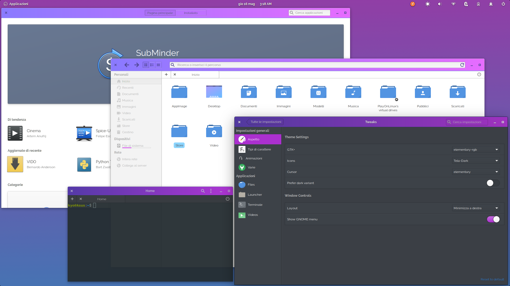

# elementary rgb 
### **Theme for elementaryOS Juno**

### **Installation:**
Extract the zip file in the theme directory as admin "/ usr / share / themes /" or create if there is no "~ / .themes /" directory in the home directory.

Now set the theme with Elementary Tweaks or with this command from Terminal (gsettings set org.gnome.desktop.interface gtk-theme "elementary alpha").
 

### **Notes:**
This theme is specifically for elementary OS-Juno but could also work with other distros.

It reflects the characteristics of the original elementary OS-Juno theme with the rgb variant in the top bar, also modified in dark mode.
 

### **Donations**
This work is completely free, the link below is only and exclusively if you would like to thank me tangibly.
 
 
 

